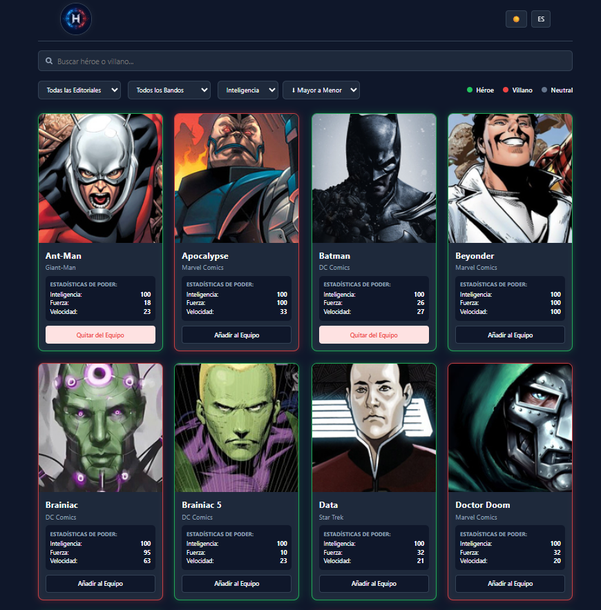
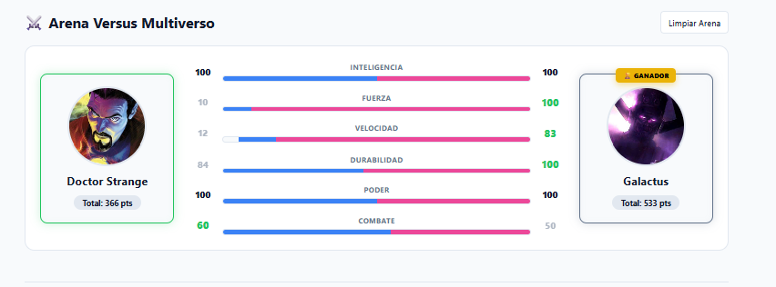
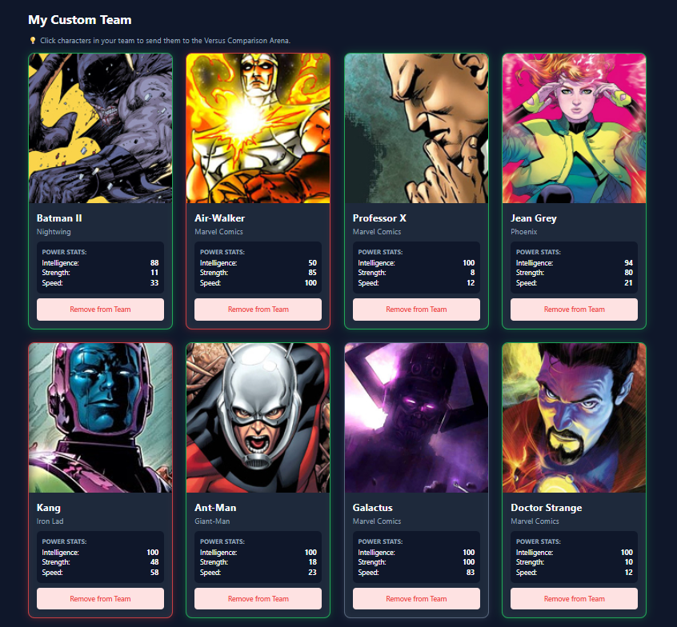

# HeroVerse 🦸‍♂️🦸‍♀️

HeroVerse es una plataforma interactiva diseñada para crear, gestionar y comparar equipos de superhéroes. Los usuarios pueden explorar estadísticas de poder y enfrentar a sus personajes favoritos en la "Arena Versus Multiverso".

## 📸 Vista Previa

|         Exploración de Héroes         | Arena Versus |        Gestión de Equipo         |
|:-------------------------------------:| :---: |:--------------------------------:|
|  |  |  |

## ✨ Características Principales
- **Buscador y Filtros:** Explora héroes por nombre, editorial, bando y estadísticas.
- **Custom Team:** Crea tu equipo ideal añadiendo o quitando personajes.
- **Arena Versus:** Sistema de comparación interactivo para medir el poder total entre dos personajes.
- **Diseño Responsive:** Experiencia optimizada para diversas pantallas.

## 🛠 Stack Tecnológico
- **Framework:** [React](https://react.dev/) + [Vite](https://vitejs.dev/)
- **Lenguaje:** [TypeScript](https://www.typescriptlang.org/)
- **Estilos:** [Tailwind CSS](https://tailwindcss.com/)

## 🚀 Instalación y Uso
1. Clona el repositorio.
2. Instala las dependencias: `npm install`
3. Inicia el entorno de desarrollo: `npm run dev`

## 🔗 Enlaces
- **Demo en vivo:** [https://heroverse-frontend-chi.vercel.app/](https://heroverse-frontend-chi.vercel.app/)

---
*Desarrollado por Edgar Montenegro.*